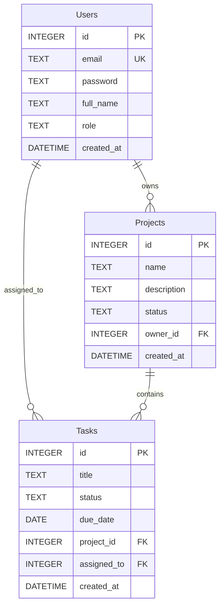

# 🚀 Nexus — Full-Stack Project & Task Management Platform


## 📖 About

**Nexus** is a lightweight, responsive full-stack project and task management workspace. It streamlines team collaboration by allowing administrators and team members to organize projects, assign and track tasks with deadlines, and manage user roles within a single glassmorphic dashboard.

---

## 📸 Overview & Key Features

- 🔐 **Authentication & Authorization**:
  - User registration & secure login with **bcrypt** password encryption.
  - Role-based permissions (**Admin** vs **User** access levels).
  - Modern login experience powered by **DotLottie** animations.

- 📁 **Project Management**:
  - Create, view, update, and delete projects.
  - Track project status (`Active`, `Planning`, `Completed`, etc.).
  - Associate projects with team owners.

- ✅ **Task Tracking**:
  - Full CRUD task workflow linked to specific projects.
  - Status management (`Pending`, `In Progress`, `Completed`).
  - Assign tasks to team members and set due dates.

- 👥 **User Management**:
  - Administrative control panel to create, update, and manage team members and their roles.

- 🎨 **Modern Design & UX**:
  - Responsive glassmorphism interface with custom CSS design tokens.
  - Interactive sidebar navigation with **Lucide** icons.
  - Smooth micro-interactions and transitions.

---

## 🛠️ Tech Stack

### Frontend
- **Framework**: [React 19](https://react.dev/)
- **Bundler & Dev Server**: [Vite](https://vitejs.dev/)
- **Routing**: [React Router v7](https://reactrouter.com/)
- **Icons**: [Lucide React](https://lucide.dev/)
- **Animations**: [@lottiefiles/dotlottie-react](https://github.com/LottieFiles/dotlottie-react)
- **Styling**: Vanilla CSS (Modular & Glassmorphic)

### Backend
- **Runtime**: [Node.js](https://nodejs.org/)
- **Server Framework**: [Express 5](https://expressjs.com/)
- **Database**: [SQLite3](https://www.sqlite.org/)
- **Security**: [bcryptjs](https://github.com/dcodeIO/bcrypt.js)
- **Middleware**: [CORS](https://github.com/expressjs/cors)

---

## 📂 Project Structure

```text
nexus/
├── backend/
│   ├── database.sqlite      # SQLite database file
│   ├── init_db.js           # Database seeding & migration script
│   ├── package.json         # Backend dependencies & scripts
│   └── server.js            # Express REST API server
├── frontend/
│   ├── public/              # Static assets (Lottie files, images)
│   ├── src/
│   │   ├── assets/          # App assets
│   │   ├── components/      # Reusable UI (Navbar, Sidebar)
│   │   ├── pages/           # Application views (Login, Projects, Tasks, Management)
│   │   ├── App.jsx          # Route configuration
│   │   ├── index.css        # Global design tokens & styling
│   │   └── main.jsx         # Application entrypoint
│   ├── index.html           # HTML template
│   ├── package.json         # Frontend dependencies & scripts
│   └── vite.config.js       # Vite configuration
├── package.json             # Root monorepo script runner (concurrently)
└── README.md                # Project documentation
```

---

## ⚡ Getting Started

### Prerequisites
- [Node.js](https://nodejs.org/) (v18.x or later recommended)
- [npm](https://www.npmjs.com/)

---

### 1. Installation

Install dependencies for root, backend, and frontend with a single command:

```bash
npm run install:all
```

*Or install them individually:*
```bash
# Root dependencies
npm install

# Backend dependencies
cd backend && npm install

# Frontend dependencies
cd ../frontend && npm install
```

---

### 2. (Optional) Initialize / Seed the Database

The database comes pre-initialized, but you can reset and seed it with mock users, projects, and tasks at any time:

```bash
node backend/init_db.js
```

---

### 3. Start the Development Servers

Run both the backend and frontend concurrently with one command from the project root:

```bash
npm run dev
```

The servers will start at:
- **Frontend App**: [http://localhost:5173](http://localhost:5173) *(or [http://localhost:5174](http://localhost:5174))*
- **Backend API**: [http://localhost:3001](http://localhost:3001)

---

## 🔑 Default Test Accounts

| Full Name | Email | Password | Role |
| :--- | :--- | :--- | :--- |
| **Admin User** | `admin@example.com` | `admin123` | **Admin** |
| **John Doe** | `john@example.com` | `password` | **User** |

---

## 📡 REST API Reference

### Authentication
| Method | Endpoint | Description | Request Body |
| :--- | :--- | :--- | :--- |
| `POST` | `/api/register` | Register a new user | `{ email, password, full_name, role? }` |
| `POST` | `/api/login` | Authenticate user | `{ email, password }` |

### Users
| Method | Endpoint | Description | Request Body |
| :--- | :--- | :--- | :--- |
| `GET` | `/api/users` | Retrieve all users | — |
| `POST` | `/api/users` | Create user (Admin) | `{ email, full_name, role }` |
| `PUT` | `/api/users/:id` | Update user details | `{ email, full_name, role }` |
| `DELETE` | `/api/users/:id` | Delete user | — |

### Projects
| Method | Endpoint | Description | Request Body |
| :--- | :--- | :--- | :--- |
| `GET` | `/api/projects` | List all projects with owner names | — |
| `POST` | `/api/projects` | Create a new project | `{ name, description, status?, owner_id }` |
| `PUT` | `/api/projects/:id` | Update an existing project | `{ name, description, status, owner_id }` |
| `DELETE` | `/api/projects/:id` | Delete a project | — |

### Tasks
| Method | Endpoint | Description | Request Body |
| :--- | :--- | :--- | :--- |
| `GET` | `/api/tasks` | List all tasks with project and assignee | — |
| `POST` | `/api/tasks` | Create a new task | `{ title, status?, due_date?, project_id, assigned_to? }` |
| `PUT` | `/api/tasks/:id` | Update a task | `{ title, status, due_date, project_id, assigned_to }` |
| `DELETE` | `/api/tasks/:id` | Delete a task | — |

---

## 🗄️ Database Schema



---

## 📜 Available Scripts

From the project root:

| Command | Description |
| :--- | :--- |
| `npm run dev` | Runs both backend and frontend development servers concurrently |
| `npm run install:all` | Installs dependencies across root, backend, and frontend |
| `npm run build --prefix frontend` | Builds production bundle for the frontend |
| `npm run lint --prefix frontend` | Runs fast code linting via Oxlint |
