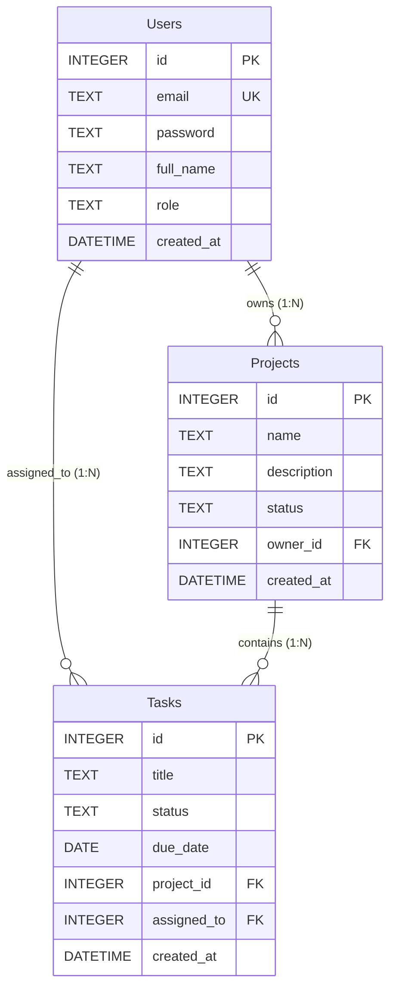

## 📖 About The Project

**Nexus** is a full-stack, responsive project and task management workspace. It provides a complete administrative and operational platform that integrates an **Express REST API backend**, a normalized **SQLite relational database**, and a modern **React 19 GUI frontend** with glassmorphic styling.

---

## ✨ Key Features & GUI Overview

### 1. 📊 Task Manager Dashboard (`/dashboard`)
- **Executive KPI Metrics**: Live trackers for Total Tasks, In Progress, Completed (with % completion rate bar), and Blocked items.
- **Active Projects Progress Strip**: Visual progress meters per project with instant 1-click filtering.
- **Interactive Kanban Pipeline**: 4 columns (`Pending`, `In Progress`, `Completed`, `Blocked`) with 1-click status progression (`Start`, `Complete`, `Reopen`, `Resume`).
- **Dual View Modes**: Switch seamlessly between Kanban Board view and Data Table list view.
- **Quick Actions**: Add, edit, and remove tasks directly with modal overlays.

### 2. 📁 Project Management (`/projects`)
- Full CRUD operations for team projects.
- Status management (`Active`, `Planning`, `Completed`).
- Association of projects with dedicated team owners (`Users`).

### 3. ✅ Task Tracking (`/tasks`)
- Tabular task management with real-time search and multi-criteria filters.
- Project associations, user assignments, and due-date deadlines with overdue alerts.

### 4. 👥 User & Role Management (`/management`)
- Administrative control panel to create, update, and manage users.
- Role-based distinction (`Admin` vs `User`).

### 5. 🔐 Authentication & Security (`/login`)
- Secure registration and login flows.
- Password encryption powered by **bcryptjs** (salt rounds = 10).
- Input sanitization and parameterized SQL statements preventing SQL injection attacks.

---

## 🗄️ Relational Database Architecture

### Entity Relationship Diagram (ERD)



---

## 📐 Database Normalization Proof (Up to 3NF)

The database schema is strictly designed and normalized up to **Third Normal Form (3NF)** to ensure zero redundancy and maximum referential integrity:

### 1. First Normal Form (1NF)
- **Atomic Values**: Every attribute contains only atomic (indivisible) scalar values. There are no repeating groups or multi-valued fields (e.g. tasks are stored as separate rows rather than arrays inside projects).
- **Primary Keys**: Every relation has a defined, unique Primary Key (`id`).

### 2. Second Normal Form (2NF)
- Satisfies 1NF.
- **No Partial Dependencies**: Every non-key attribute is fully functionally dependent on the entire Primary Key. Because all tables use a single-attribute surrogate key (`id`), partial key dependencies cannot exist.

### 3. Third Normal Form (3NF)
- Satisfies 2NF.
- **No Transitive Dependencies**: Non-prime attributes depend *only* on the primary key, and not on any other non-prime attribute.
  - In `Projects`, `owner_id` is stored as a Foreign Key referencing `Users(id)` rather than storing user emails or roles inside `Projects`.
  - In `Tasks`, `project_id` and `assigned_to` are Foreign Keys referencing their respective parent entities.
  - Queries fetch related metadata (`project_name`, `owner_name`, `assigned_name`) dynamically using SQL `LEFT JOIN` operations at query time.

### 4. Referential Integrity & Constraints
- SQLite foreign key constraints are strictly enforced at runtime:
  ```sql
  PRAGMA foreign_keys = ON;
  ```
- Cascading updates/deletions (`ON DELETE CASCADE` and `ON DELETE SET NULL`) prevent orphaned records.

---

## 📋 Full CRUD Operations Matrix

| Entity | Create (C) | Read (R) | Update (U) | Delete (D) | GUI View |
| :--- | :--- | :--- | :--- | :--- | :--- |
| **Users** | `POST /api/users`<br>`POST /api/register` | `GET /api/users` | `PUT /api/users/:id` | `DELETE /api/users/:id` | Users Page (`/management`) |
| **Projects** | `POST /api/projects` | `GET /api/projects` | `PUT /api/projects/:id` | `DELETE /api/projects/:id` | Projects Page (`/projects`) |
| **Tasks** | `POST /api/tasks` | `GET /api/tasks` | `PUT /api/tasks/:id` | `DELETE /api/tasks/:id` | Dashboard (`/dashboard`)<br>Tasks Page (`/tasks`) |

---

## 🛠️ Technology Stack

| Layer | Technology | Purpose |
| :--- | :--- | :--- |
| **Frontend Framework** | React 19 + Vite | Fast single-page application |
| **Routing** | React Router v7 | Protected layout and nested routes |
| **Icons & UI** | Lucide React | Clean, scalable vector icons |
| **Styling** | Vanilla CSS Tokens | Glassmorphism design tokens (no heavy CSS frameworks) |
| **Backend Runtime** | Node.js | Server runtime |
| **Server Framework** | Express 5 | RESTful API endpoints and middleware |
| **Database** | SQLite3 | Normalized relational database with foreign keys |
| **Security** | bcryptjs | Salted password hashing (10 rounds) |
| **Code Quality** | Oxlint | Strict code validation and linting |

---

## ⚡ Getting Started

### Prerequisites
- [Node.js](https://nodejs.org/) (v18.x or later)
- [npm](https://www.npmjs.com/)

### 1. Installation
Install root, backend, and frontend dependencies with one command:
```bash
npm run install:all
```

### 2. Database Initialization (Optional)
The database comes pre-seeded with sample users, projects, and tasks. To re-initialize:
```bash
node backend/init_db.js
```

### 3. Run Development Servers
Start both backend (port 3001) and frontend (port 5173) concurrently:
```bash
npm run dev
```

Open your browser at:
- **Frontend App**: [http://localhost:5173](http://localhost:5173)
- **Backend API**: [http://localhost:3001](http://localhost:3001)

### 4. Default Credentials
| Email | Password | Role |
| :--- | :--- | :--- |
| `admin@example.com` | `admin123` | Admin |
| `john@example.com` | `password` | User |

---

## 📜 Project Scripts

| Script | Command | Description |
| :--- | :--- | :--- |
| `npm run dev` | Root | Concurrently runs backend and frontend dev servers |
| `npm run install:all` | Root | Installs all dependencies across the project |
| `npm run build --prefix frontend` | Frontend | Builds optimized production bundle |
| `npm run lint --prefix frontend` | Frontend | Runs Oxlint code inspection |
